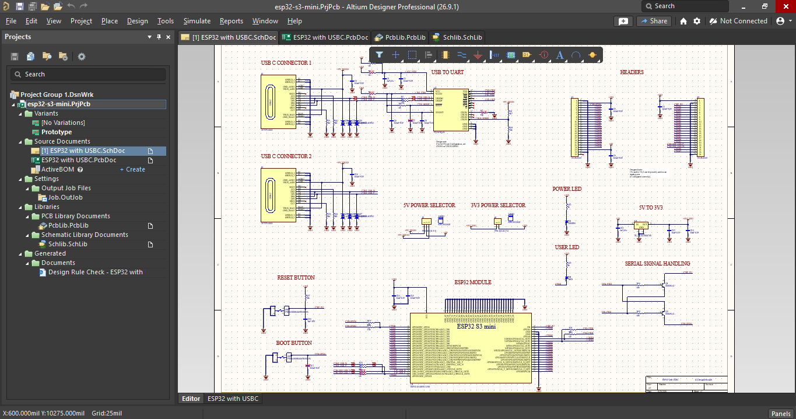
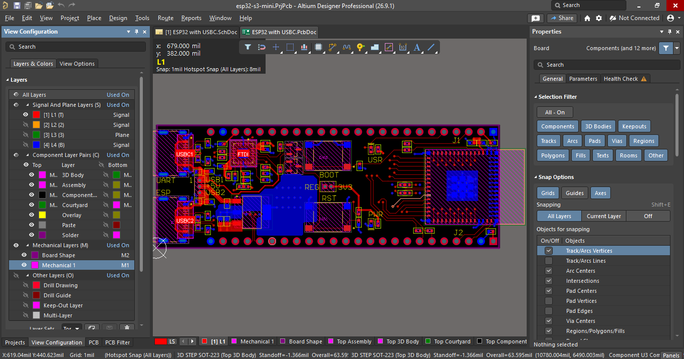
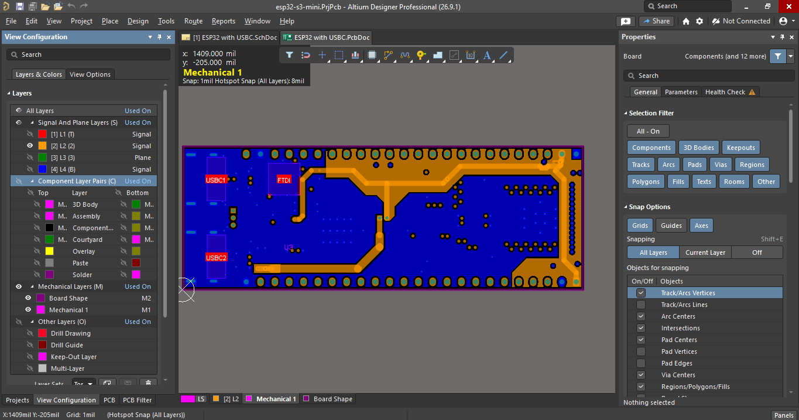
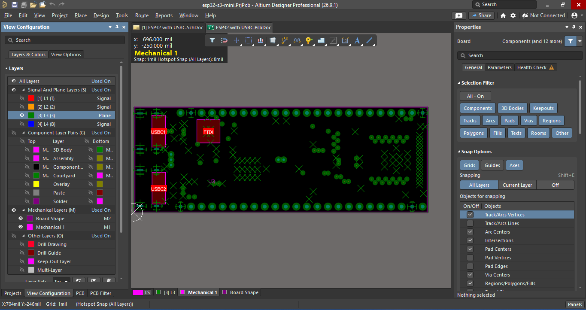
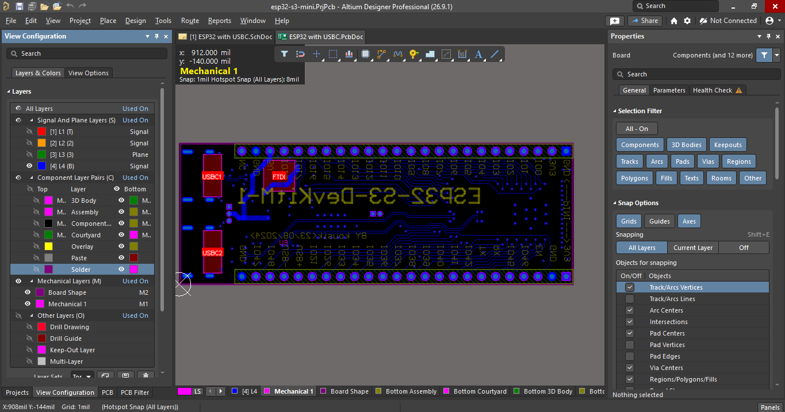

# ⚡ ESP32-S3 USB-C Hardware Board Design

## 📌 Project Overview

This project features a custom **4-layer PCB design** for the **ESP32-S3 Mini** microcontroller with a native **USB-C** interface, developed in **Altium Designer**. 

All schematic symbols, PCB footprints, stackup configurations, and 3D component models were built from scratch and assembled following design practices from **Robert Feranec's** hardware design tutorials.

---

### 🛠 Key Specifications

| Parameter | Details |
| :--- | :--- |
| **CAD Tool** | Altium Designer |
| **Microcontroller** | ESP32-S3 Mini |
| **PCB Layer Count** | 4 Layers (Signal - GND - PWR - Signal) |
| **Connector Type** | USB Type-C (USB 2.0 High-Speed) |
| **Library Assets** | Custom Symbols, Footprints & 3D STEP Models |
| **Impedance Control** | $90\,\Omega$ Differential Traces for USB ($D+/D-$) |

---

## 📁 Repository Structure

```text
ESP32_S3_USBC/
│
├── 📁 3D/                                    # Component STEP models
├── 📁 Docs/                                  # Datasheets & Pinout reference files
├── 📁 Image/                                 # 3D Renders, Schematics & Layer screenshots
├── 📁 Project Logs for esp32-s3-mini/        # Altium ECO compilation logs
├── 📁 Project Outputs for esp32-s3-mini/     # Gerber, BOM & DRC Reports
│
├── 📄 ESP32 with USBC.PcbDoc                 # 4-Layer PCB Board Layout
├── 📄 ESP32 with USBC.SchDoc                 # Circuit Schematic Document
├── 📄 Job.OutJob                             # Altium Output Job Configuration
├── 📄 PcbLib.PcbLib                          # Custom PCB Footprint Library
├── 📄 Schlib.SchLib                          # Custom Schematic Symbol Library
├── 📄 esp32-s3-mini.PrjPcb                   # Main Altium Project File
├── 📄 esp32-s3-mini.PrjPcbStructure          # Altium Project Metadata
└── 📄 README.md                              # Project Documentation
```

## 📐 Design Files & Visual Previews

### 📄 1. Circuit Schematic (`ESP32 with USBC.SchDoc`)
Complete circuit schematic including ESP32-S3 microcontroller circuitry, USB-C interface, power regulation, and ESD protection:



---

### 🗂️ 2. 4-Layer PCB Board Stackup & Renders (`ESP32 with USBC.PcbDoc`)
Complete 4-layer routing layout, stackup configuration, impedance-matched differential traces, and 3D renderings.

#### PCB Layer Stackup


#### 3D Board Views
| Top View (3D Render) | Bottom View (3D Render) |
| :---: | :---: |
|  |  |

#### 2x2 PCB Layer Breakdown
| Layer 1 (Top Signal) | Layer 2 (GND Plane) |
| :---: | :---: |
|  |  |
| **Layer 3 (Power Plane)** | **Layer 4 (Bottom Signal)** |
|  |  |

---

### 📦 3. Custom Libraries & Project Files
* **`esp32-s3-mini.PrjPcb`** — Main Altium Designer Project file
* **`Schlib.SchLib`** — Custom Schematic Symbol Library
* **`PcbLib.PcbLib`** — Custom Component Footprint Library
* **`Job.OutJob`** — Altium Manufacturing Output Job File

## 🎓 Acknowledgments & References

This hardware design was created by following the expert hardware engineering tutorials provided by **Robert Feranec**. 

* **Instructor:** Robert Feranec (Hardware Design Engineer & Educator)
* **YouTube Channel:** [FEDEVEL Educational / Robert Feranec](https://www.youtube.com/watch?v=KWIzhbQaZZk)
* **Topics Covered:** Altium Designer workflows, 4-layer PCB stackup planning, custom component footprint creation, and USB differential pair routing.
